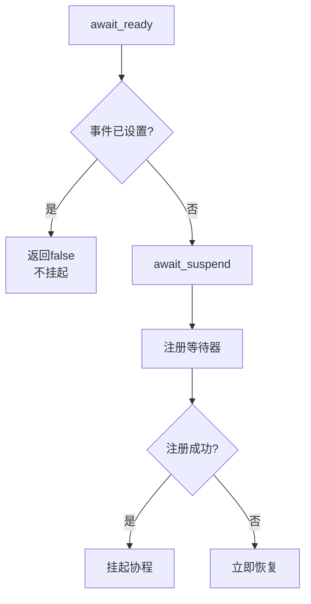
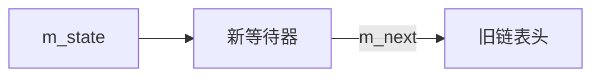

# 协程事件系统实现文档
## 概述
该文档详细说明了C++协程事件系统的实现原理和关键设计，提供了代码注释、核心机制解释和使用指南。

## 文件路径
coro/comp/event.hpp

## 关键知识点详解
### 1. 协程等待器三件套机制
每个协程等待器必须实现三个核心函数：


+ await_ready()
  + 首先调用m_ctx.register_wait()通知上下文有新等待协程
  + 检查事件是否已设置
  + 返回true表示无需挂起，false表示需要挂起
+ await_suspend(coroutine_handle)
  + 保存协程句柄用于后续恢复
  + 调用register_awaiter注册到事件系统
  + 返回值决定是否挂起协程
+ await_resume()
  + 在基类中未实现
  + 子类可重写实现自定义恢复逻辑
  + 通常用于处理返回值或清理资源

### 2. 原子操作与内存顺序
事件系统使用原子操作确保线程安全：

```Cpp
m_state.exchange(this, std::memory_order_acq_rel)
```

+ exchange操作：原子交换操作，返回旧值

+ 内存顺序：

  + memory_order_acquire：保证后续读取能看到此操作前的写入
  + memory_order_release：保证此操作前的写入对后续操作可见
  + memory_order_acq_rel：同时包含acquire和release语义
+ CAS循环：

```Cpp
  while (!compare_exchange_weak(old_value, new_value))
```
+ 无锁编程的核心模式
+ 确保多线程环境下安全更新状态
+ weak版本允许虚假失败，但性能更好

### 3.等待器链表管理
事件系统使用链表管理所有等待该事件的协程：

